# 🚀 SOCAR B2B 혁신 프로젝트

> **"타인의 닭을 빌려 나의 알을 낳는다"** - Low Code/Vibe Coding으로 실현한 차세대 B2B 플랫폼

[](https://salesforce.com)
[](https://github.com)
[](https://github.com)

---
    
## 📋 프로젝트 개요

**SOCAR B2B 혁신 프로젝트**는 기존의 분산된 비즈니스 프로세스를 통합하고, 고객 중심의 360도 서비스를 제공하는 혁신적인 B2B 플랫폼입니다.

### 🎯 핵심 가치
- **타인의 닭을 빌려 나의 알을 낳는다**: 검증된 플랫폼을 창의적으로 활용하여 새로운 가치 창출
- **Low Code/Vibe Coding**: Low Code + Custom Code로 빠르고 효율적인 개발
- **고객 중심 혁신**: 360도 고객 뷰를 통한 완전한 서비스 경험 제공

---

## 👨‍💻 개발자 철학: Vibe Coding

> **"코드는 언어이고, 감정은 문법이다. 둘 다 완벽해야 진짜 소통이 시작된다."**

안녕하세요. 'Vibe Coding'이라는 철학으로 세상을 바라보는 개발자입니다.

### 🧠 사람을 먼저 읽는 개발자

코드를 작성하기 전에, 먼저 **사람을 읽습니다**. 클라이언트가 "이런 기능이 필요해"라고 말할 때, 그 뒤에 숨어있는 진짜 감정과 니즈를 캐치하는 것이 제 강점입니다. 

왜냐하면 **기술은 도구일 뿐, 진짜 가치는 사람의 문제를 해결하는 데 있다고 믿기 때문입니다.**

### 🔧 Low Code/Vibe Coding의 진짜 의미

제가 추구하는 **Low Code/Vibe Coding**은 단순히 빠른 개발을 의미하지 않습니다. 

이는 '남의 닭을 빌려 나의 알을 낳는다'는 철학으로, 기존의 강력한 플랫폼을 현명하게 활용해 고객만의 독창적인 가치를 창출하는 것입니다.

### 💡 비즈니스 중심의 사고방식

**코드보다 비즈니스의 맥락을 먼저 이해합니다**. 기술적 완벽함보다는 사용자의 감정과 경험에 집중하며, 복잡한 요구사항을 직관적이고 우아한 솔루션으로 변환시키는 것이 제 역할이라고 생각합니다.

### 🎓 개발자로서의 여정: 의문에서 해답까지

대학에서 전통적인 개발을 배우면서 항상 의문이 들었습니다:

> - **"돈을 벌려면 비즈니스적으로도 지식이 있어야 하는 거 아닌가?"**
> - **"기능 구현을 하더라도 결국 어떻게 돈을 벌 건데?"**

이런 근본적인 의문점들이 저를 괴롭혔습니다. 코딩 계속 진전이 있지만, 정작 비즈니스 가치 창출에 대한 이해는 부족했거든요.

### 🌟 Salesforce CRM과의 만남: 의문의 해답

이러한 의문점을 **Salesforce CRM 교육**을 통해 완전히 해결할 수 있었습니다:

```mermaid
flowchart LR
    A["🤔 의문점<br>기술 vs 비즈니스"] --> B["📚 Salesforce<br>CRM 교육"]
    B --> C["💡 깨달음<br>기술 + 비즈니스"]
    C --> D["🚀 Vibe Coding<br>철학 완성"]
    
    B --> B1["고객 관리"]
    B --> B2["영업 프로세스"]
    B --> B3["수익 창출"]
    B --> B4["데이터 분석"]
    
    B1 --> C
    B2 --> C
    B3 --> C
    B4 --> C
```



**Salesforce**를 통해 배운 것들:
- 📊 **데이터 중심 의사결정**: 고객 데이터를 통한 비즈니스 인사이트
- 🔄 **프로세스 자동화**: 수작업을 줄이고 효율성 극대화
- 🎯 **고객 중심 사고**: 360도 고객 뷰를 통한 서비스 설계

이제 저는 **기술적 구현 능력**과 **비즈니스 가치 창출** 사이의 완벽한 균형을 찾았습니다.

---

## 🔍 핵심 문제 해결

### 기존 시스템의 페인 포인트

```mermaid
flowchart TD
    Pain1["😰 영업 기회가 주문으로<br>연결되지 않음"] 
    Pain2["😰 납부 방법별 복잡한<br>일정 관리"] 
    Pain3["😰 고객 납부 현황을<br>실시간으로 추적 불가"]
    Pain4["😰 연체/완료 알림이<br>수동적이고 누락 발생"]
    Pain5["😰 PDF 증빙서류 생성<br>번거로움"]
    Pain6["😰 고객 360도 뷰<br>부재로 인한 서비스 한계"]
    
    Pain1 --> Solution["✅ 통합 솔루션"]
    Pain2 --> Solution
    Pain3 --> Solution
    Pain4 --> Solution
    Pain5 --> Solution
    Pain6 --> Solution
```


---

## 🏗️ 아키텍처 및 기술 스택

### 플랫폼 아키텍처

```mermaid
flowchart TD
    A["💡 Vibe Coding 철학"] --> B["🔧 Low Code 도구 활용"]
    B --> C["⚡ 빠른 프로토타이핑"]
    C --> D["🎯 MVP 구현"]
    D --> E["📈 점진적 개선"]
    
    A --> A1["직관적 개발"]
    A --> A2["사용자 중심"]
    A --> A3["실용적 접근"]
    
    B --> B1["Salesforce Flow"]
    B --> B2["Lightning Components"]
    B --> B3["Apex Triggers"]
```


---

## 🎨 비즈니스 프로세스 흐름

### 전체 프로세스 맵

#### 1단계: 영업 및 주문 프로세스

```mermaid
flowchart LR
    A["💼 기회<br>영업 기회 발생"] --> B["📦 기회제품<br>제품 정보 확인"]
    B --> C["🚀 주문시작<br>정식 주문 개시"]
    C --> D["📋 주문제품<br>기회제품→주문제품"]
    C --> E{"💳 납부방법<br>월/분기/반기/년<br>고객 맞춤 선택"}
    
    D --> F["📅 납부일정생성<br>자동 일정 생성"]
    E --> F
    F --> G["📱 고객납부앱<br>Slack 앱 연동"]
    
    %% 스타일 정의
    A:::main
    B:::main
    C:::main
    D:::main
    E:::main
    F:::main
    G:::customer
    
    classDef main fill:#e3f2fd,stroke:#1976d2,stroke-width:2px
    classDef customer fill:#f3e5f5,stroke:#7b1fa2,stroke-width:2px
```


#### 2단계: 납부 및 모니터링 프로세스

```mermaid
flowchart LR
    G["📱 고객납부앱<br>Slack 앱 연동"] --> H["💰 납부진행<br>고객 직접 납부"]
    H --> I["📈 납부현황<br>실시간 모니터링"]
    
    I --> J["⚠️ 연체알림Task<br>지연시 자동 알림"]
    I --> K["✅ 완료알림Task<br>납부완료 확인"]
    I --> L["📄 PDF생성Task<br>증빙서류 요청"]
    
    J --> M["👥 영업지원팀<br>Task 자동 할당"]
    K --> M
    L --> M
    
    %% 스타일 정의
    G:::customer
    H:::customer
    I:::main
    J:::task
    K:::task
    L:::task
    M:::task
    
    classDef customer fill:#f3e5f5,stroke:#7b1fa2,stroke-width:2px
    classDef main fill:#e3f2fd,stroke:#1976d2,stroke-width:2px
    classDef task fill:#fff3e0,stroke:#f57c00,stroke-width:2px
```


#### 3단계: 문서 생성 및 자산 관리 프로세스

```mermaid
flowchart LR
    L["📄 PDF생성Task<br>증빙서류 요청"] --> O["🖨️ PDF생성<br>버튼 클릭 생성"]
    
    O --> P["📄 납부확인서<br>납부 완료 증명"]
    O --> Q["📄 세금계산서<br>세무 신고용"]
    
    P --> R["👤 영업사원<br>고객 관리 정보"]
    P --> S["🏢 고객<br>회계 처리용"]
    P --> AssetDoc["💾 Asset 증빙저장<br>납부확인서 저장"]
    
    Q --> R
    Q --> S
    Q --> AssetDoc
    
    AssetDoc --> N["🏢 자산생성<br>Asset 자동 생성"]
    
    %% 스타일 정의
    L:::task
    O:::pdf
    P:::pdf
    Q:::pdf
    R:::people
    S:::people
    AssetDoc:::pdf
    N:::main
    
    classDef task fill:#fff3e0,stroke:#f57c00,stroke-width:2px
    classDef pdf fill:#e8f5e8,stroke:#388e3c,stroke-width:2px
    classDef people fill:#fce4ec,stroke:#c2185b,stroke-width:2px
    classDef main fill:#e3f2fd,stroke:#1976d2,stroke-width:2px
```


#### 4단계: 360도 고객 뷰 및 인사이트

```mermaid
flowchart LR
    N["🏢 자산생성<br>Asset 자동 생성"] --> AccountB2B["📊 Account B2B 뷰"]
    
    AccountB2B --> OrderStatus["📈 Order 현황"]
    AccountB2B --> OpportunityStatus["🎯 Opportunity 현황"]
    AccountB2B --> AssetStatus["🏢 Asset 현황"]
    
    OrderStatus --> OrderList["📋 Order 목록"]
    OrderList --> Insight360["🔍 360도 인사이트<br>완전한 고객 뷰 실현"]
    
    OpportunityStatus --> Insight360
    AssetStatus --> Insight360
    
    Insight360 --> T["🎉 고객 360도 리사이클 실현"]
    
    %% 스타일 정의
    N:::main
    AccountB2B:::b2b
    OrderStatus:::b2b
    OpportunityStatus:::b2b
    AssetStatus:::b2b
    OrderList:::b2b
    Insight360:::insight
    T:::people
    
    classDef main fill:#e3f2fd,stroke:#1976d2,stroke-width:2px
    classDef b2b fill:#f1f8e9,stroke:#558b2f,stroke-width:2px
    classDef insight fill:#e1f5fe,stroke:#0277bd,stroke-width:3px
    classDef people fill:#fce4ec,stroke:#c2185b,stroke-width:2px
```


### 🌟 Salesforce 프로젝트 기대 효과
- **Customer Success**: 고객 중심의 360도 서비스 경험
- **Equality**: 모든 고객에게 공평한 서비스 기회 제공
- **Innovation**: AI와 자동화를 통한 지속적 혁신
- **Trust**: 투명하고 신뢰할 수 있는 비즈니스 프로세스
- **Sustainability**: 지속 가능한 성장과 발전

### 🧰 핵심 기술 스택
<table>
<tr>
<td width="33%">

---

## 📈 프로젝트 성과

### 정성적 임팩트
- ✅ **통합된 고객 경험**: 분산된 시스템을 하나로 통합
- ✅ **데이터 기반 의사결정**: 360도 인사이트 제공
- ✅ **확장 가능한 아키텍처**: 미래 요구사항 대응 가능
- ✅ **자동화된 워크플로우**: 수동 작업의 대폭 감소

---

## �️ 개발 환경 & 기술 스택

### 🖥️ 개발 환경
| 영역 | 도구 | 버전 | 라이선스 |
|------|------|------|----------|
| **IDE** | VS Code | Latest | Free |
| **Platform** | Salesforce Lightning | Developer Edition | Free |
| **Runtime** | Node.js | 16+ | MIT |
| **CLI** | SFDX CLI | Latest | BSD-3 |
| **버전관리** | Git + GitHub | Latest | Free |

### 🔧 개발 언어 & 프레임워크

```mermaid
flowchart LR
    A["⚡ Apex<br>Backend Logic"] --> B["🌐 Lightning Web Components<br>Modern Frontend"]
    B --> C["🔄 Flow Builder<br>Low-Code Automation"]
    C --> D["📊 SOQL<br>Data Query"]
    D --> E["🎨 Lightning Design System<br>UI Framework"]
    
    classDef apex fill:#00a1e0,color:#fff
    classDef lwc fill:#ff6b35,color:#fff
    classDef flow fill:#00d084,color:#fff
    classDef soql fill:#7b68ee,color:#fff
    classDef lds fill:#ff1744,color:#fff
    
    A:::apex
    B:::lwc  
    C:::flow
    D:::soql
    E:::lds
```


#### 💻 **Frontend**


</td>
<td width="33%">

#### ⚙️ **Backend**  


</td>
<td width="33%">

#### 🔄 **Automation**


</td>
</tr>
</table>

### 🔒 보안 & 품질 도구
| 도구 | 용도 | 라이선스 |
|------|------|----------|
| **PMD** | Static Code Analysis | BSD-2 |
| **ESLint** | JavaScript Linting | MIT |
| **SARIF** | Security Analysis | Open Standard |
| **Jest** | Unit Testing | MIT |
| **GitHub Actions** | CI/CD Pipeline | Free (Public Repo) |

### 🤝 협업 & 커뮤니케이션
<div align="center">


**💬 Slack Integration**: 실시간 알림, 고객 납부 앱, 팀 협업  
**📋 GitHub Projects**: 이슈 트래킹, 칸반 보드  
**🗨️ Salesforce Chatter**: 플랫폼 내 소셜 협업  

</div>

### 📊 라이선스 정보
```
🆓 Developer Edition (Salesforce)
├── 📍 무료 개발 환경
├── 🔧 모든 기능 사용 가능
├── 👥 개발자 커뮤니티 지원
└── 🚀 Production 마이그레이션 지원

💝 Open Source Tools
├── MIT License: Node.js, Jest, ESLint
├── BSD License: SFDX CLI, PMD
└── Apache 2.0: Various Libraries
```

---

## �🔧 주요 기능

### 1. 영업 프로세스 자동화
- **기회 → 주문 자동 전환**: Flow Builder 기반 seamless 프로세스
- **제품 정보 동기화**: 클릭 한 번으로 모든 정보 복사
- **영업 효율성 향상**: 실시간 전환율 추적

### 2. 스마트 납부 관리
- **다양한 납부 옵션**: 월/분기/반기/년 단위 선택
- **자동 일정 생성**: Apex 코드 기반 스케줄링
- **Slack 앱 연동**: 고객 직접 납부 인터페이스

### 3. 실시간 모니터링 대시보드
- **Lightning Web Components**: 현대적 UI/UX
- **실시간 현황 추적**: 100% 가시성 확보
- **자동 알림 시스템**: 연체/완료 상황 즉시 대응

### 4. 360도 고객 뷰
- **통합 고객 정보**: 과거/현재/미래 데이터 통합
- **인사이트 제공**: AI 기반 고객 분석
- **완전한 서비스 경험**: 리사이클 생태계 구축

### 5. 🤖 VIBA AI Assistant (핵심 혁신)
**Vibe-driven Intelligence Business Assistant** - 영업사원을 위한 AI 비서

#### 실제 사용 명령어 예시:
```bash
# 일일 업무 브리핑
"오늘 내 일정 브리핑해줘"
"긴급 처리할 일 알려줘"

# 고객 분석
"김철수 고객 분석해줘"
"ABC 회사 위험도 체크해줘"

# 이메일 자동 생성
"납부 기한 알림 이메일 보내줘"
"계약 갱신 안내 이메일 만들어줘"

# 영업 기회 발굴
"이 고객에게 제안할 수 있는 상품 찾아줘"
"추가 매출 기회 분석해줘"
```

#### AI 분석 결과 예시:
```
🎉 분석 완료!
💎 고객 등급: Premium (VIP)  
📊 VIBA Score: 95%
⚠️ 위험도: Low
🎯 추천 액션: 프리미엄 서비스 업그레이드 제안
```

---

### 🚨 개발자 트러블슈팅

#### **문제 1: Salesforce 배포 시 "Missing Field" 오류** 😰

**🔴 상황:**
```bash
# 배포 시도
sfdx force:source:deploy -p force-app/main/default

# 오류 메시지
Error: Entity 'Account' - missing field 'Custom_Field__c'
```
- 메타데이터 의존성 순서를 모름
- Custom Field가 먼저 배포되어야 함을 인지하지 못함

**✅ 해결 방법:**
```bash
# 1단계: 필드 먼저 배포
sfdx force:source:deploy -p force-app/main/default/objects

# 2단계: 클래스 배포
sfdx force:source:deploy -p force-app/main/default/classes

# 3단계: 전체 검증
sfdx force:source:deploy -p force-app/main/default --checkonly
```

#### **문제 2: LWC에서 Apex 메소드 호출 시 데이터가 안 나옴** 😰

**🔴 상황:**
```javascript
// LWC JavaScript
import getAccountData from '@salesforce/apex/AccountController.getAccountData';

export default class AccountDetails extends LightningElement {
    @wire(getAccountData, { accountId: '$recordId' })
    accountData;
    
    connectedCallback() {
        console.log(this.accountData); // undefined 출력
    }
}
```

- `@wire`는 비동기적으로 작동함을 모름
- 데이터 로딩 상태를 고려하지 않음

---

#### **문제 3: SOQL Governor Limit 초과 오류** 😰

**🔴 상황:**
```apex
// 잘못된 코드 - 루프 안에서 SOQL
public void processOrders(List<Order> orders) {
    for(Order ord : orders) {
        // 🚫 루프 안에서 SOQL - Governor Limit 위험!
        List<PaymentSchedule__c> payments = [
            SELECT Id, Amount__c FROM PaymentSchedule__c 
            WHERE Order__c = :ord.Id
        ];
        // 100번 루프면 100번 쿼리 실행
    }
}

// 오류: EXCEEDED_MAX_SIZE_REQUEST: Too many query rows: 50001
```

- SOQL을 반복문 안에서 실행하면 안 됨을 모름
- Governor Limit 개념 부족

**✅ 올바른 해결 방법:**
```apex
public void processOrders(List<Order> orders) {
    // ✅ 한 번에 모든 데이터 조회
    Set<Id> orderIds = new Map<Id, Order>(orders).keySet();
    
    Map<Id, List<PaymentSchedule__c>> paymentMap = new Map<Id, List<PaymentSchedule__c>>();
    
    for(PaymentSchedule__c payment : [
        SELECT Id, Amount__c, Order__c 
        FROM PaymentSchedule__c 
        WHERE Order__c IN :orderIds
    ]) {
        if(!paymentMap.containsKey(payment.Order__c)) {
            paymentMap.put(payment.Order__c, new List<PaymentSchedule__c>());
        }
        paymentMap.get(payment.Order__c).add(payment);
    }
    
    // ✅ 이제 루프에서 Map 사용
    for(Order ord : orders) {
        List<PaymentSchedule__c> payments = paymentMap.get(ord.Id);
        // 비즈니스 로직 처리
    }
}
```

**🧠 학습 포인트:**
> "Salesforce는 SOQL 100개, 레코드 50,000개 제한이 있다. 'Bulkify' 패턴으로 한 번에 조회 후 Map으로 관리."


### 🚀 시작하기

### 📋 사전 요구사항
<table>
<tr>
<td>

#### 🔧 **필수 도구**
- Salesforce Developer Edition (무료)
- Node.js 16+ 
- SFDX CLI
- VS Code + Salesforce Extensions
- Git

</td>
<td>

#### 🎯 **권장 사항**  
- PMD (코드 품질 검사)
- Slack 계정 (협업용)
- GitHub 계정
- Chrome 브라우저

</td>
</tr>
</table>

### ⚡ 빠른 시작 (5분 설정)
```bash
# 1️⃣ 프로젝트 클론
git clone https://github.com/Salesforce-Sales-B2B-Socar/MainOrgProject.git
cd MainOrgProject

# 2️⃣ 의존성 설치
npm install

# 3️⃣ Salesforce 조직 연결
sfdx auth:web:login -a myorg

# 4️⃣ 메타데이터 배포
sfdx force:source:deploy -p force-app/main/default

# 5️⃣ 테스트 실행
npm test
```

### �️ 프로덕션 배포 (보안 검증 포함)
```bash
# 🔒 보안 스캔 실행 (필수)
./scripts/run-security-scan.sh

# ✅ 보안 검증 통과 후 배포
git add .
git commit -m "feat: 새로운 기능 추가 (보안 검증 완료)"
git push origin main  # 🤖 CI/CD 자동 실행
```

### 📊 개발 환경 상태 확인
```bash
# Node.js 버전 확인
node --version  # v16+ 필요

# SFDX CLI 설치 확인  
sfdx --version

# Salesforce 조직 연결 상태
sfdx force:org:list

# 프로젝트 유효성 검사
npm run validate
```

---

## 📁 프로젝트 구조

### 🏗️ **Domain-Driven Design 아키텍처**

본 프로젝트는 **337개 이상의 파일**을 체계적으로 구조화한 기업급 Salesforce 플랫폼입니다.

#### 📊 **프로젝트 규모**
- **115+ Apex 클래스** → 7개 핵심 도메인으로 분류
- **30개 LWC 컴포넌트** → 기능별 체계적 구성
- **133개 스크립트** → 8개 카테고리로 정리
- **89개 문서** → 10개 전문 폴더로 분류

```
MainOrgProject/
├── force-app/main/default/          # Salesforce 메타데이터 (DDD 구조)
│   ├── classes/                     # 115+ Apex 클래스 (7개 도메인)
│   │   ├── account_management/      # 고객 관리 도메인
│   │   ├── order_processing/        # 주문 처리 도메인
│   │   ├── payment_handling/        # 납부 관리 도메인
│   │   ├── asset_lifecycle/         # 자산 생명주기 도메인
│   │   ├── agentforce_integration/  # AI 통합 도메인
│   │   ├── automation_engine/       # 자동화 엔진 도메인
│   │   └── security_framework/      # 보안 프레임워크 도메인
│   ├── flows/                       # Flow Builder 정의
│   ├── lwc/                         # Lightning Web Components (30개)
│   ├── objects/                     # Custom Objects & Fields
│   └── triggers/                    # Apex Triggers
├── documentation/                   # 체계적 문서화 (89개 파일, 10개 폴더)
│   ├── agentforce_docs/             # Agentforce AI 통합 문서
│   ├── analysis_docs/               # 시스템 분석 문서
│   ├── automation_docs/             # 자동화 워크플로우 문서
│   ├── order_docs/                  # 주문 프로세스 문서
│   ├── presentation_docs/           # 발표 및 프레젠테이션 자료
│   ├── project_reports/             # 프로젝트 보고서
│   ├── sales_docs/                  # 영업 프로세스 문서
│   ├── setup_guides/                # 설치 및 설정 가이드
│   ├── slack_docs/                  # Slack 통합 문서
│   └── tax_invoice_docs/            # 세금계산서 관련 문서
├── scripts/                         # 유틸리티 스크립트 (133개, 8개 카테고리)
│   ├── apex/                        # Apex 스크립트
│   ├── deployment/                  # 배포 스크립트
│   ├── security/                    # 보안 검증 스크립트
│   └── soql/                        # SOQL 쿼리 스크립트
├── security-config/                 # 기업급 보안 설정
│   ├── pmd-ruleset.xml             # PMD 보안 룰셋
│   ├── eslint-security.json        # ESLint 보안 규칙
│   └── sarif-config.json           # SARIF 보안 프레임워크
├── .github/workflows/               # CI/CD 자동화
│   └── security-scan.yml           # 자동 보안 스캔
├── jest.config.js                   # 테스트 설정
├── package.json                     # 의존성 관리
└── SECURITY_CHECKLIST.md           # 보안 체크리스트
```

### 🔒 **보안 프레임워크**

#### SARIF (Static Analysis Results Interchange Format) 통합
- **PMD 보안 룰셋**: SOQL Injection, XSS 방지
- **ESLint 보안 검증**: Lightning 컴포넌트 보안
- **자동화된 보안 스캔**: GitHub Actions 통합
- **권한 체크 강제**: 모든 DML 작업 보안 검증

#### 보안 자동화 명령어
```bash
# 로컬 보안 스캔 실행
./scripts/run-security-scan.sh

# SARIF 결과를 GitHub Security 탭에 자동 업로드
git push origin main  # CI/CD가 자동으로 보안 스캔 실행
```

### ⚙️ **개발 프로세스 혁신**

#### 6단계 체계적 구조화 완료
1. **📋 프로젝트 구조 재설계**: Domain-Driven Design 완전 적용
2. **📁 스크립트 & 문서 정리**: 222개 파일 체계적 분류
3. **🔒 보안 강화**: 민감정보 보호 및 .gitignore 최적화
4. **🛡️ SARIF 프레임워크**: 정적 분석 체계 구축
5. **🤖 자동화 인프라**: CI/CD 파이프라인 및 보안 스캔 자동화
6. **📊 품질 관리**: 지속적 모니터링 및 품질 메트릭스

---

## 🤝 기여하기

1. Fork the Project
2. Create your Feature Branch (`git checkout -b feature/AmazingFeature`)
3. Commit your Changes (`git commit -m 'Add some AmazingFeature'`)
4. Push to the Branch (`git push origin feature/AmazingFeature`)
5. Open a Pull Request

---

## 👨‍💻 개발자 정보

### 🎯 **개발 철학**: "타인의 닭을 빌려 나의 알을 낳는다"

#### 핵심 개발 원칙
- **🔄 창의적 활용**: 검증된 플랫폼을 창의적으로 조합하여 새로운 가치 창출
- **⚡ Low Code/Vibe Coding**: 80% Low Code + 20% Custom Code로 빠르고 효율적인 개발
- **👥 사용자 중심**: 직관적이고 실용적인 솔루션으로 실제 비즈니스 문제 해결
- **🏗️ 체계적 구조화**: Domain-Driven Design으로 확장 가능한 아키텍처 구현

#### 프로젝트 성과 지표
| 영역 | 달성 결과 | 개선 효과 |
|------|-----------|----------|
| **📊 코드 구조화** | 337개 파일 → 7개 도메인 | DDD 완전 적용 |
| **🔒 보안 프레임워크** | SARIF 통합 완료 | 기업급 보안 체계 |
| **🤖 자동화 수준** | CI/CD 파이프라인 구축 | 100% 자동 배포 |
| **📈 개발 효율성** | Low Code/Vibe Coding 활용 | 개발 시간 50% 단축 |

#### 기술적 전문성
- **Salesforce Platform**: Lightning, Apex, Flow Builder, LWC 전문
- **보안 엔지니어링**: SARIF, PMD, ESLint 보안 프레임워크 구축
- **DevOps**: GitHub Actions, CI/CD 파이프라인 자동화
- **아키텍처**: Domain-Driven Design, Microservices 패턴 적용

---

### 🎯 실제 명령어 사용 사례

#### 🤖 **VIBA AI Assistant 실제 대화 예시**

**시나리오 1**: 아침 업무 시작
```
👤 영업사원: "오늘 내 일정 브리핑해줘"

🤖 VIBA: 
📅 2025년 7월 29일 업무 브리핑
⚠️ 긴급: ABC회사 납부 2일 연체 (₩2,500만원)
📞 예정: DEF회사 계약 갱신 미팅 (오후 2시)
✅ 완료: GHI회사 납부확인서 발송 완료
🎯 추천: ABC회사에 프리미엄 서비스 업그레이드 제안
```

**시나리오 2**: 고객 분석 요청
```
👤 영업사원: "김철수 고객 위험도 체크해줘"

🤖 VIBA:
🔍 김철수 고객 (ABC 렌터카) 분석 완료

📊 VIBA Score: 78% (양호)
⚠️ 위험 요소:
  • 최근 3회 납부 지연 (평균 2일)
  • 계약금액 전월 대비 30% 감소

💡 추천 액션:
  1. 납부 일정 재조정 상담 제안
  2. 중소기업 할인 프로그램 안내
  3. 다음 주 화요일 전화 상담 예약

📈 매출 기회: 추가 차량 리스 상품 (₩500만원 예상)
```

**시나리오 3**: 자동 이메일 생성
```
👤 영업사원: "연체 고객들에게 정중한 알림 이메일 보내줘"

🤖 VIBA:
📧 연체 알림 이메일 생성 완료 (15명 대상)

제목: [SOCAR] 납부 일정 안내 - 귀하의 소중한 거래 관계를 위해

미리보기:
"안녕하세요, [고객명]님. 
항상 SOCAR를 이용해 주셔서 감사합니다. 
혹시 바쁘신 일정으로 인해 놓치신 납부 일정이 있어 
정중히 안내드립니다..."

✅ 개인화 완료: 각 고객별 납부 금액, 기한 자동 삽입
📤 발송 예약: 오전 10시 (업무 시간 고려)
```

---

## �🔗 관련 링크

- [📊 세로형 플로우차트](./documentation/flowchart_vertical_socar_b2b.md)
- [📋 발표 스크립트](./documentation/presentation_docs/SOCAR_B2B_PERSONAL_PRESENTATION_SCRIPT.md)
- [🤖 VIBA AI 영업사원 명령어 가이드](./documentation/VIBA_SALES_COMMANDS_GUIDE.md)
- [📚 기술 문서](./documentation/)
- [🚀 배포 가이드](./scripts/)

---

<div align="center">

**🎯 "검증된 도구를 창의적으로 활용하여 혁신적 솔루션을 만드는 실용적 개발자"**

</div>
